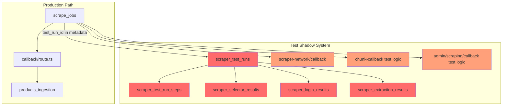
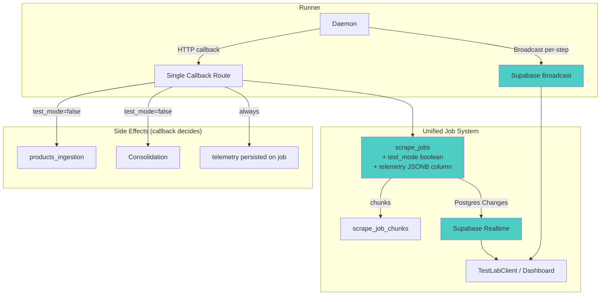

# Honest Architectural Critique: Should Test Runs Be Separate?

## TL;DR

**No.** The current architecture is not best practice. The decision to treat test runs as a separate entity from scrape jobs was a mistake that has created a parallel shadow system — 5 extra database tables, 3 duplicate callback routes, and ~1,500 lines of glue code — all to track something the `scrape_jobs` table already tracks. **You should gut this.**

---

## The Core Problem: Test Runs Are Scrape Jobs

Looking at the daemon ([daemon.py](file:///c:/Users/thoma/OneDrive/Desktop/scripts/BayState/apps/scraper/daemon.py)), the runner **doesn't know or care** whether a job is a test or not. It claims a chunk, runs it, and submits results. The only difference is a `test_mode` boolean that tells the callback to skip `products_ingestion` persistence.

Here's the entire "test vs production" distinction at the runner level:

```python
# daemon.py:204 - Test mode is just a boolean on the job config
job_config.test_mode = chunk.test_mode
```

That's it. The runner does *exactly* the same work for both. But on the web side, you built an entirely separate tracking system:

### What You Built (What Exists Today)



### The Damage

| Entity | Purpose | Redundant With |
|--------|---------|---------------|
| `scraper_test_runs` | Track test status, results, timing | `scrape_jobs.status`, `scrape_jobs.completed_at` |
| `scraper_test_run_steps` | Step-by-step telemetry for tests | Should be on all jobs, not test-only |
| `scraper_selector_results` | Selector validation results | Never queried for production insights |
| `scraper_login_results` | Login step results | Never queried for production insights |
| `scraper_extraction_results` | Extraction field results | Never queried for production insights |
| `scraper-network/callback` | Separate test callback route | Nearly identical to `admin/scraping/callback` |
| [studio/test/route.ts](file:///c:/Users/thoma/OneDrive/Desktop/scripts/BayState/apps/web/app/api/admin/scrapers/studio/test/route.ts) | Create test runs | Could be `scrape_jobs` insert with `test_mode=true` |
| `studio/test/[id]` | Poll test status | Could be `scrape_jobs` status check |

> [!WARNING]
> **You have 3 callback routes that each independently try to update `scraper_test_runs`.** They have different status calculation logic, different telemetry handling, and can race each other. This alone explains a huge portion of the fragility.

---

## Why This Architecture Failed

### 1. Dual Source of Truth

The test run status lives in **two places**: `scrape_jobs.status` and `scraper_test_runs.status`. They update independently, at different times, from different callback routes. The frontend polls `scraper_test_runs`, but the meaningful status transitions happen on `scrape_jobs`. The glue code that keeps them in sync is unreliable:

```typescript
// callback/route.ts:608 — Only updates test_run if still 'pending'
} else if (existingRun?.status === 'pending') {
```

If the race condition hits, or the callback fails, the test run stays [pending](file:///c:/Users/thoma/OneDrive/Desktop/scripts/BayState/apps/scraper/core/realtime_manager.py#447-458) forever — even though the job completed successfully.

### 2. The Realtime Was Built For the Wrong Tables

You have Supabase Postgres Changes subscriptions on:
- `scraper_test_runs` (not used by TestLabClient)
- `scraper_test_run_steps` (not used by TestLabClient)
- `scrape_jobs` (used, but only to detect terminal state)

But the **TestLabClient** ignores all of them in favor of 3-second HTTP polling to `/studio/test/{id}`, which queries `scraper_test_runs`. The realtime hooks exist in the codebase but are disconnected from the primary UI.

### 3. Step Telemetry Is Test-Only — But Shouldn't Be

`scraper_test_run_steps`, `scraper_selector_results`, etc. capture extremely valuable operational data — which selectors are breaking, which logins are failing, which fields are extracting empty. But because they're wired only to the test shadow system, you **never get this data for production scrape jobs**. The data that would help you debug production failures is only captured in test mode.

### 4. The Runner Has All the Right Tools — But Doesn't Use Them

The [RealtimeManager](file:///c:/Users/thoma/OneDrive/Desktop/scripts/BayState/apps/scraper/core/realtime_manager.py#30-525) ([realtime_manager.py](file:///c:/Users/thoma/OneDrive/Desktop/scripts/BayState/apps/scraper/core/realtime_manager.py)) already has:
- [broadcast_job_progress(job_id, status, progress, message)](file:///c:/Users/thoma/OneDrive/Desktop/scripts/BayState/apps/scraper/core/realtime_manager.py#342-380) — for live progress
- [broadcast_job_log(job_id, level, message)](file:///c:/Users/thoma/OneDrive/Desktop/scripts/BayState/apps/scraper/core/realtime_manager.py#381-416) — for live logs

But the daemon only calls [broadcast_job_progress](file:///c:/Users/thoma/OneDrive/Desktop/scripts/BayState/apps/scraper/core/realtime_manager.py#342-380) **once**, at chunk start:

```python
# daemon.py:297 — Only broadcast: "Chunk processing started"
await rm.broadcast_job_progress(chunk.job_id, "started", 0, "Chunk processing started")
```

It never sends progress updates during execution. It never sends log broadcasts. The entire realtime infrastructure is sitting there unused.

---

## What Best Practice Looks Like

The industry standard for this pattern (CI/CD systems like GitHub Actions, CircleCI, DataDog Synthetic Tests) is:

> **A test run IS a job run with additional metadata and different side effects.**

Not a separate entity. Not separate tables. Not separate callbacks.

### Proposed Architecture: Kill the Shadow System



### What Changes

| Current | Proposed |
|---------|----------|
| `scraper_test_runs` table | **Delete.** Use `scrape_jobs` with `test_mode=true` |
| `scraper_test_run_steps` table | **Delete.** Store telemetry as JSONB on `scrape_jobs` or `scrape_job_chunks` |
| `scraper_selector_results` table | **Delete.** Inline into chunk telemetry (available for ALL jobs, not just tests) |
| `scraper_login_results` table | **Delete.** Inline into chunk telemetry |
| `scraper_extraction_results` table | **Delete.** Inline into chunk telemetry |
| 3 callback routes with test logic | **Single callback route.** `test_mode` flag controls side effects |
| 5 realtime hooks | **2 hooks:** Postgres Changes on `scrape_jobs`, Broadcast for live progress |
| 3s HTTP polling as primary | **Postgres Changes as primary**, 30s polling as fallback |
| TestLabClient creates test_run + job | **Just creates a job** with `test_mode=true` |
| `/studio/test/{id}` polls test_run | **Subscribe to `scrape_jobs` changes** for the job ID |

### How Test Mode Would Differ

| Behavior | `test_mode=false` | `test_mode=true` |
|----------|-------------------|-------------------|
| Execution | Same | Same |
| Telemetry capture | Always (on chunk results) | Always (on chunk results) |
| `products_ingestion` update | Yes | No |
| Auto-consolidation trigger | Yes | No |
| Live progress broadcast | Yes | Yes |
| Frontend display | Jobs dashboard | Test Lab (same data, different view) |
| Results retention | Long-term | Short-term (auto-cleanup after 7d) |

---

## Recommended Action

### Phase 1: Stop the Bleeding (Quick Fixes)

Before gutting anything, fix the worst symptoms on the current system:

1. **Add timeout logic** — if `scraper_test_runs.started_at` is > 10 minutes ago and status is still [pending](file:///c:/Users/thoma/OneDrive/Desktop/scripts/BayState/apps/scraper/core/realtime_manager.py#447-458), auto-fail it
2. **Fix the status guard** — change `=== 'pending'` to `!== 'passed' && !== 'failed' && !== 'partial'`
3. **Wire [useTestRunRecordSubscription](file:///c:/Users/thoma/OneDrive/Desktop/scripts/BayState/apps/web/lib/realtime/useTestRunRecordSubscription.ts#28-132) into TestLabClient** — subscribe to `scraper_test_runs` changes as primary, demote polling to fallback

### Phase 2: Unify the System (Gut Rebuild)

1. **Migrate test-lab to read from `scrape_jobs` directly** — the job already has all the data
2. **Add a `telemetry` JSONB column to `scrape_job_chunks`** — store steps, selectors, extractions here for ALL jobs
3. **Delete `scraper_test_runs` and all 4 detail tables** after migrating historical data
4. **Consolidate to single callback route** — `test_mode` flag controls side effects
5. **Wire runner to broadcast per-step progress** — the [RealtimeManager](file:///c:/Users/thoma/OneDrive/Desktop/scripts/BayState/apps/scraper/core/realtime_manager.py#30-525) methods already exist
6. **Frontend subscribes to `scrape_jobs` Postgres Changes + Broadcast** — true real-time

---

## Summary

The answer to your question is clear: **No, test runs should not be treated differently from normal runs.** A test is just a scrape job that doesn't persist to the product pipeline. The current shadow system of 5 tables, 3 callbacks, and 5 realtime hooks was an over-engineering mistake that created complexity without delivering the reliability or real-time experience it was designed for.

The good news: the runner-side code is actually well-architected. The [RealtimeManager](file:///c:/Users/thoma/OneDrive/Desktop/scripts/BayState/apps/scraper/core/realtime_manager.py#30-525) already has broadcast methods for per-step progress and logs — they just aren't called. The daemon already treats test and production jobs identically. **The problem is entirely on the web app side**, where the shadow tracking system was bolted on top.

Gut it. Make a test run just a scrape job with `test_mode=true`. Wire the existing broadcast infrastructure. You'll delete ~1,500 lines of code and 5 tables, and end up with a simpler, more reliable system.
